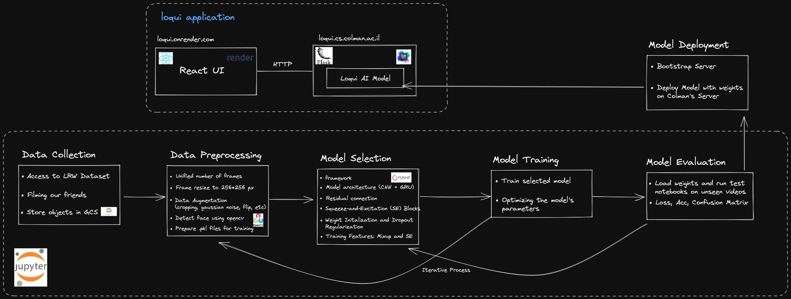
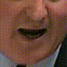

# loqui 
Welcome to our advanced lips reading model repository - "loqui".

Here, we present a state-of-the-art deep lips-reading techniques, along with pre-trained models and training settings.

Our model has been extensively evaluated on the LRW Dataset, achieving impressive accuracy results of 85.4%.

Our model excels at decoding spoken words, making it an invaluable asset for a wide range of applications, including transcription services, accessibility enhancements, and more.

Join us on this journey as we unlock the potential of lips reading technology and bring words to life

# Architecture 

To better understand the architecture of our model, take a look at the image above. It provides an overview of the components and how they work together to enable accurate lips reading.

# Dataset
The LRW Dataset is a comprehensive and meticulously curated dataset designed specifically for training and evaluating lips reading models.
This dataset comprises a vast collection of 500 words, carefully selected to represent diverse vocabulary encountered in everyday conversations.
Each word is visually recorded through high-quality videos, capturing the detailed movements and articulations of the speakers' lips.

# Preprocessing
We provide scripts and tools within this repository to facilitate the seamless integration of the LRW Dataset into your lips reading pipeline.
The dataset preparation scripts allow for efficient extraction and preprocessing of the videos, ensuring that they are in the appropriate format for training and testing your models.
Additionally, we provide pre-trained models and training settings that leverage the LRW Dataset, enabling you to build upon existing state-of-the-art performance or explore new avenues in lips reading research.

The data is preprocessed using opencv python package and resized to 88x88 frames, this being serialized as .pkl files for smooth integration together with the label and video duration.

The `scripts/prepare_lrw.py` script is supplied in this repository and is being used for the preprocessing.

<table style="display: inline-table;">  
<tr><td></td><td></td><td></td><td></td></tr>
<tr><td>0. Original</td> <td>1. Detection</td> <td>2. Transformation</td> <td>3. Mouth ROIs</td> </tr>
</table>

# Training
For the training of our lips reading model, we leveraged the computational power provided by a machine equipped with an NVIDIA GPU, generously provided by our college. This allowed us to efficiently process and train deep neural networks on the extensive LRW Dataset.

To facilitate data management and accessibility, we stored the preprocessed .pkl files containing the mouth videos, labels, and word boundary information in a Google Cloud Storage (GCS) bucket. We developed an Extract, Transform, Load (ETL) pipeline that seamlessly downloaded the necessary files from the GCS bucket into our training server, ensuring smooth and efficient data retrieval.

We embarked on training our model on all 500 words present in the LRW Dataset, starting from scratch without any pre-existing features. This approach enabled us to capture the intricacies of lip movements across a wide range of vocabulary, enhancing the model's ability to recognize and understand various spoken words.

To maximize the model's performance, we trained it for a total of 500 epochs, allowing the network to learn from the data and optimize its parameters over an extended period. Through these iterations, the model progressively improved its lip reading capabilities, gradually reducing the training loss and enhancing its accuracy on the validation set.

Among the various models we trained, the most accurate one emerged as the combination of a ResNet18 convolutional neural network as the backbone, followed by a Bidirectional Gated Recurrent Unit (BiGRU) for temporal modeling. This model, referred to as "ResNet18 + BiGRU (Baseline with word boundary + Cosine LR)," demonstrated superior performance in capturing lip movements and effectively associating them with the corresponding words.

By employing cutting-edge architectures and leveraging the vast training data of the LRW Dataset, we successfully developed a highly accurate and reliable lip reading model. This model holds great potential for applications in speech recognition, transcription, and inclusive communication for individuals with hearing impairments.

# User Interface
To provide a seamless and user-friendly experience, we developed a web-based user interface (UI) that allows users to upload a single video and test it using our state-of-the-art lip reading model. This UI serves as a simple yet powerful demonstration of the practical application of our model in real-world scenarios.

With our intuitive interface, anyone can effortlessly upload their video and obtain instant predictions of the spoken words. The UI handles the processing of the uploaded video, leveraging the power of our lip reading model to accurately analyze the lip movements and generate predictions. Users can witness the model in action as it swiftly processes the video, making it suitable for applications like live streaming, real-time captioning, and more.

The purpose of this UI is to showcase the effectiveness and versatility of our lip reading model in a practical setting. By allowing users to interact with the model through a user-friendly interface, we aim to promote accessibility and inclusivity, enhancing content understanding for individuals with hearing impairments and non-native speakers.

Through our UI, we provide a glimpse into the future of video-based interactions, where cutting-edge AI technology enables seamless communication and understanding across diverse linguistic backgrounds.

# Testing
To evaluate the performance of our lips reading model, we conducted extensive testing using various evaluation metrics. We assessed the model's accuracy, precision, recall, and F1 score to gauge its effectiveness in decoding spoken words.

During testing, we used the LRW Dataset, which contains a diverse range of 500 words recorded in high-quality videos. We employed the pre-trained model and testing settings provided in this repository to ensure consistency and reproducibility of the results.

To facilitate testing, we provide notebooks in the "notebooks/" directory, specifically the "test-single-video-production-videos.ipynb" notebook. This notebook allows you to test single images or videos, providing predictions for the spoken words based on the lip movements captured in the input.

By using this notebook, you can evaluate the performance of our lips reading model on your own images or videos, gaining insights into its capabilities and potential applications.

Feel free to explore the provided notebooks and conduct your own testing to witness the power of our lip reading model in action.

# Installation:
1. Install TurboJPEG: The pyturbojpeg module is a Python wrapper for the TurboJPEG library. You need to install TurboJPEG before you can install pyturbojpeg. You can download the TurboJPEG library from the official website: https://libjpeg-turbo.org/Download/
2. Run pip3 install -r requirements.txt
3. run

